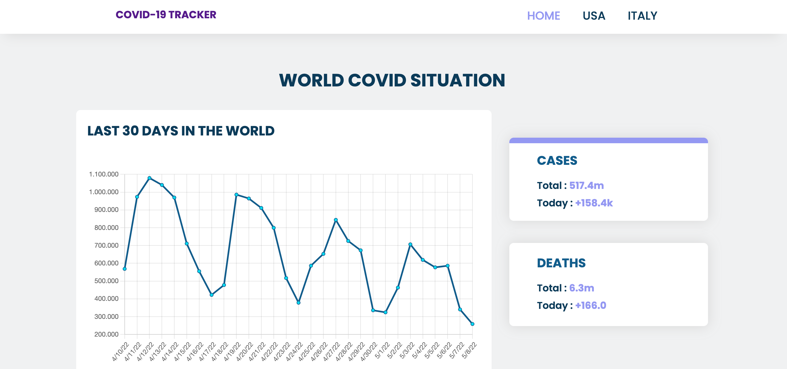
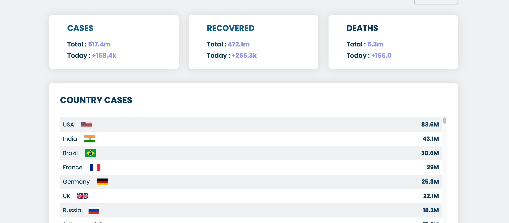
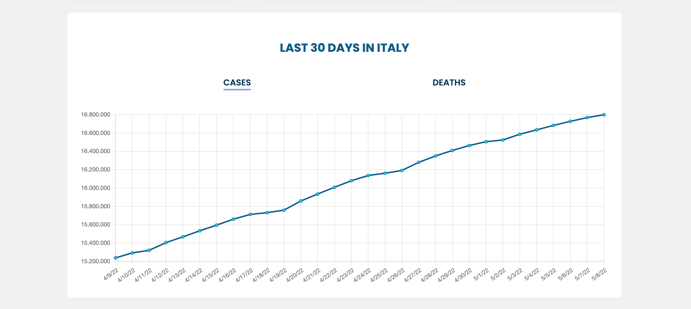

<div id="top"></div>


<!-- PROJECT LOGO -->
<br />
<div >
  <a href="https://github.com/othneildrew/Best-README-Template">
    
    <br />
    
     <br />
    
  </a>
  
 

 
  


<!-- TABLE OF CONTENTS -->
<details>
  <summary>Table of Contents</summary>
  <ol>
    <li>
      <a href="#about-the-project">About The Project</a>
      <ul>
        <li><a href="#built-with">Built With</a></li>
      </ul>
    </li>
    <li>
      <a href="#getting-started">Getting Started</a>
      <ul>
        <li><a href="#prerequisites">Prerequisites</a></li>
        <li><a href="#installation">Installation</a></li>
      </ul>
    </li>
    <li><a href="#license">License</a></li>
    <li><a href="#contact">Contact</a></li>
  </ol>
</details>


<!-- ABOUT THE PROJECT -->
## About The Project


This is a dashboard built with React that fetches and displays COVID-19 data from  [DISEASE.SH](https://disease.sh/docs/#/COVID-19%3A%20JHUCSSE/get_v3_covid_19_historical__country_) free API.


This dashboard displays the following data: 
  - page with world's cases, recovered,  deaths and history cases of last 30 days (home page).
  - page with USA and relative states covid situation (USA page).
  - page with ITALY covid situation (ITALY page).
  

Use the `BLANK_README.md` to get started.

<p align="right">(<a href="#top">back to top</a>)</p>


### Built With
- [React](https://it.reactjs.org/)
- [SCSS](https://sass-lang.com/)
- [CHARTJS](https://www.chartjs.org/docs/latest/)
- [MATERIALUI](https://mui.com/)  
- [AXIOS](https://axios-http.com/docs/intro)


## Getting Started

### Prerequisites

Running the application requires [Node](https://nodejs.org/en/) to be installed on your operating system.

You can then install the latest version of npm from your terminal with the command:

```sh
npm install npm@latest -g
```

### Installation

1. Clone the repository locally with the git command:

   ```sh
   git clone https://github.com/luigilesca/foodApp_React_2022.git
   ```

2. Install NPM packages:

   ```sh
   npm install
   ```

3. Run the app with command:

   ```sh
   npm start
   ```

## License

Distributed under the MIT License. See `LICENSE` for more information.

## Links & Contacts

[@Luigi Lesca](https://www.linkedin.com/in/luigi-lesca/) - luigilesca@hotmail.it

Project Repository: [covid-19-tracker_2022
](https://github.com/luigilesca/covid-19-tracker_2022.git)

Project Website: [covid-19-tracker-2022-react - Netlify](https://covid-19-tracker-2022-react.netlify.app/)

Portfolio: [Luigi Lesca-web-developer-portfolio](https://talent.start2impact.it/profile/luigi-lesca)


